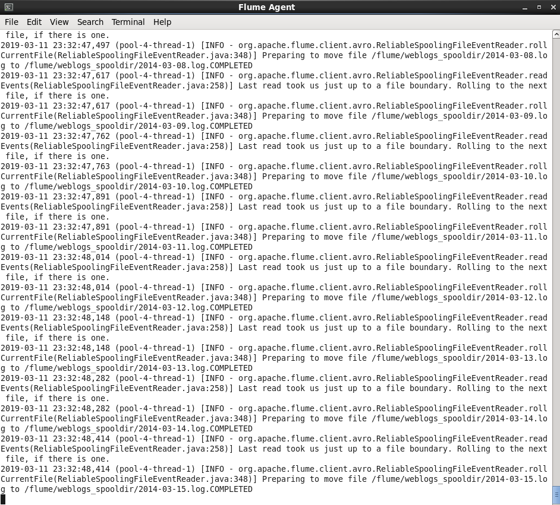

#Flafka 실습

### Flume Agent 실행할 conf-file 확인
```
[training@localhost ~]$ cat $DEVSH/exercises/flafka/spooldir_kafka.conf
# spooldir_kafka.conf: A Spooling Directory Source with a Kafka Sink

# Name the components on this agent
agent1.sources = webserver-log-source
agent1.sinks = kafka-sink
agent1.channels = memory-channel

# Configure the source
agent1.sources.webserver-log-source.type = spooldir
agent1.sources.webserver-log-source.spoolDir = /flume/weblogs_spooldir
agent1.sources.webserver-log-source.channels = memory-channel

# Configure the sink
agent1.sinks.kafka-sink.type = org.apache.flume.sink.kafka.KafkaSink
agent1.sinks.kafka-sink.topic = weblogs
agent1.sinks.kafka-sink.brokerList = localhost:9092
agent1.sinks.kafka-sink.batchSize = 20
agent1.sinks.kafka-sink.channel = memory-channel


# Use a channel which buffers events in memory
agent1.channels.memory-channel.type = memory
agent1.channels.memory-channel.capacity = 100000
agent1.channels.memory-channel.transactionCapacity = 1000

```

### Flume Agent 실행
```
flume-ng agent --conf /etc/flume-ng/conf \
--conf-file $DEVSH/exercises/flafka/spooldir_kafka.conf \
--name agent1 -Dflume.root.logger=INFO,console
```

### Kafaka Consumer
```
kafka-console-consumer \
--zookeeper localhost:2181 \
--topic weblogs
```

### copy-move-weblogs.sh 내용 참고
```
cat $DEVSH/exercises/flafka/copy-move-weblogs.sh
#!/bin/bash
#
# Create a new spool directory and move weblog files into it
# 

# Temporary staging area to copy weblog files to
TMPWEBLOGS=/tmp/tmp_weblogs

# Where the weblogs source data exists
SOURCEDIR=/home/training/training_materials/data/weblogs

if [ -z "$1" ]
then
  echo "Usage: `basename $0` spooldirpath"
  exit $E_BADARGS
fi

# Directory must exist
if [ -e "$1" ]
then
  # Directory must be empty (no *.COMPLETED files from prior run)
  if [ "$(ls $1)" ]; then
    echo "$1 exists and is not empty, delete contents? (y/n)"
    read RESPONSE
    if [ "$RESPONSE" = "y" ]; then
      rm -rf $1/*
    else
      echo "$1 is not empty, exiting"
      exit 1
    fi
  fi
else
  echo "$1 does not exist, exiting"
  exit 1
fi

echo "Copying and moving files to $1"

cp -rf $SOURCEDIR $TMPWEBLOGS
mv $TMPWEBLOGS/* $1/
```

### copy-move-weblogs.sh 수행
```
$DEVSH/exercises/flafka/copy-move-weblogs.sh \
/flume/weblogs_spooldir
```

### 결과 화면
- Flume Agent cmd 결과창



- Kafka Consumer cmd 결과창


- copy-move-weblogs.sh 수행 화면

