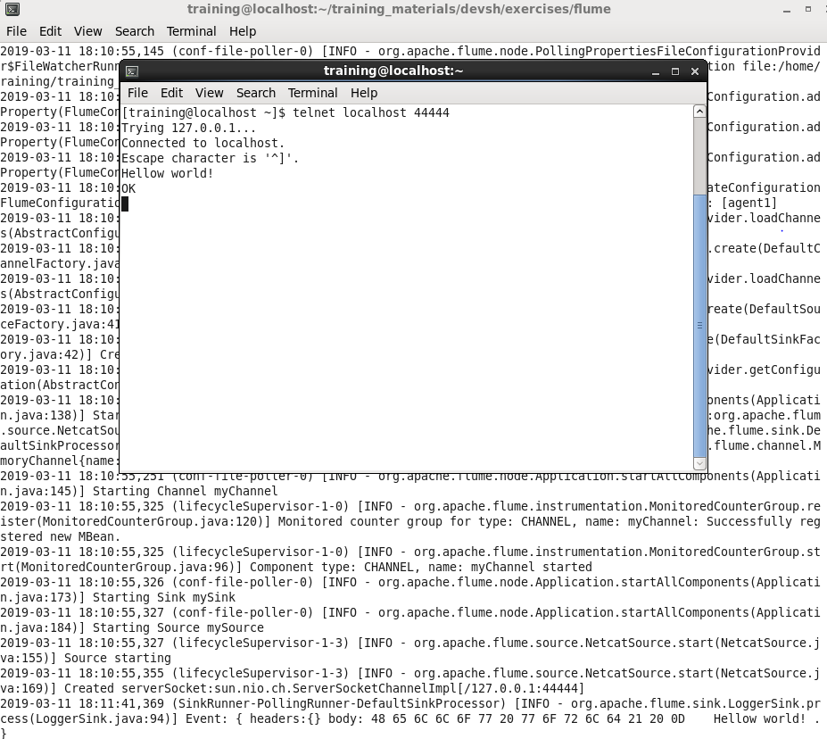

# Flume 실습
1. Create a new flume configuration file with the following:
- Source
>> Type: Netcat
>> Bind: localhost
>> Port: 44444
- Channel
>> Type: Memory
>> Capacity: 1000
>> transactionCapacity: 100
- Sink
>> Type: logger

### conf-file 저장할 경로 생성
```
mkdir /home/training/workspace/Flume
```

### 위 경로에 아래 conf-file(githubExample.conf) 저장
```
# githubExample.conf

# Name the components on this agent
agent1.sources = mySource
agent1.sinks = mySink
agent1.channels = myChannel

# Describe/configure the source
agent1.sources.mySource.type = netcat
agent1.sources.mySource.bind = localhost
agent1.sources.mySource.port = 44444

# Describe the sink
agent1.sinks.mySink.type = logger

# Use a channel which buffers events in memory
agent1.channels.myChannel.type = memory
agent1.channels.myChannel.capacity = 1000
agent1.channels.myChannel.transactionCapacity = 100

# Bind the source and sink to the channel
agent1.sources.mySource.channels = myChannel
agent1.sinks.mySink.channel = myChannel
```

2. Start the agent.
```
flume-ng agent \
--conf /etc/flume-ng/conf \
--conf-file /home/training/workspace/Flume/githubExample.conf \
--name agent1 -Dflume.root.logger=INFO,console
```

3. From another terminal start telnet and connect to port 44444. Start typing and you should see the
results from the other terminal. Provide a screenshot of your results.
```
telnet localhost 44444
```
