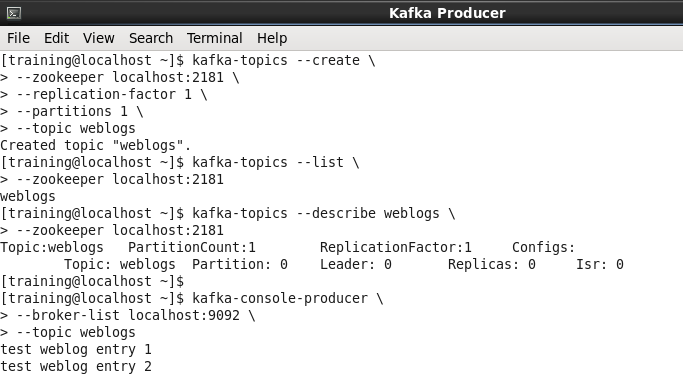
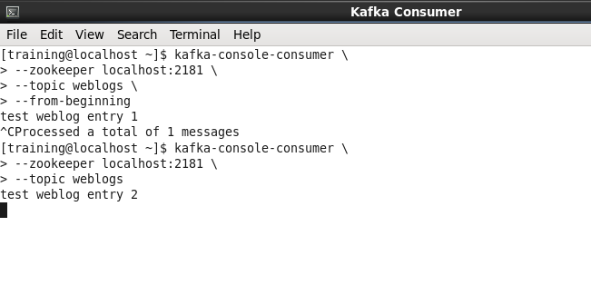

# Kafka 실습

### Kafa Topic 생성
```
kafka-topics --create \
--zookeeper localhost:2181 \
--replication-factor 1 \
--partitions 1 \
--topic weblogs
```
- 참고 사항: weblogs Topic이 이미 존재할경우 ERROR 발생

### 생성한 Topic 정보 보기
```
kafka-topics --list \
--zookeeper localhost:2181
```

```
kafka-topics --describe weblogs \
--zookeeper localhost:2181
```

### 메시지 Producing, Consuming 
> Kafka Producer
```
kafka-console-producer \
--broker-list localhost:9092 \
--topic weblogs
```
```
test weblog entry 1
```

> Kafka Consumer 
```
kafka-console-consumer \
--zookeeper localhost:2181 \
--topic weblogs \
--from-beginning
```
test weblog entry 1

> Kafka Producer (이어서 입력)
```
test weblog entry 2
```

> Kafka Consumer (기존 Ctrl+C 후 아래 명령어 실행)
```
kafka-console-consumer \
--zookeeper localhost:2181 \
--topic weblogs \
```
test weblog entry 2


### 결과 화면
> Producer cmd 결과창



> Consumer cmd 결과창

